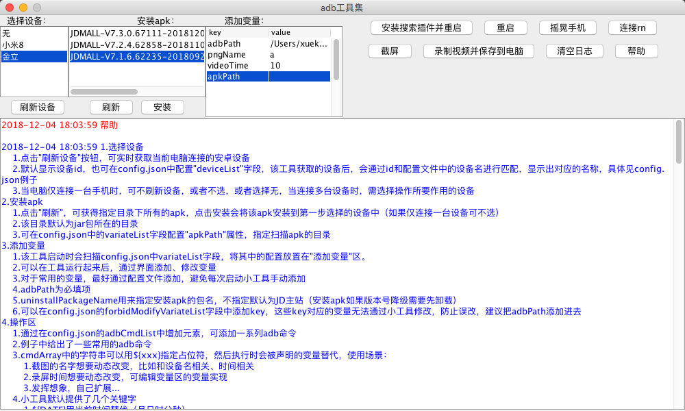

# adbUtils

一款图形化adb命令工具，支持自定义adb命令 2.0

## 帮助

### 选择设备
- 点击"刷新设备"按钮，可实时获取当前电脑连接的安卓设备
- 默认显示设备id，也可在config.json中配置"deviceList"字段，该工具获取的设备后，会通过id和配置文件中的设备名进行匹配，显示出对应的名称，具体见config.json例子
- 当电脑仅连接一台手机时，可不刷新设备，或者不选，或者选择无，当连接多台设备时，需选择操作所要作用的设备
### 安装apk
- 点击"刷新"，可获得指定目录下所有的apk，点击安装会将该apk安装到第一步选择的设备中（如果仅连接一台设备可不选）
- 该目录默认为jar包所在的目录
- 可在config.json中的variateList字段配置"apkPath"属性，指定扫描apk的目录
### 添加变量
- 该工具启动时会扫描config.json中variateList字段，将其中的配置放置在"添加变量"区。
- 可以在工具运行起来后，通过界面添加、修改变量
- 对于常用的变量，最好通过配置文件添加，避免每次启动小工具手动添加
- adbPath为必填项
- uninstallPackageName用来指定安装apk的包名，不指定默认为JD主站（安装apk如果版本号降级需要先卸载）
- 可以在config.json的forbidModifyVariateList字段中添加key，这些key对应的变量无法通过小工具修改，防止误改，建议把adbPath添加进去
### 操作区
- 通过在config.json的adbCmdList中增加元素，可添加一系列adb命令
- 例子中给出了一些常用的adb命令
- cmdArray中的字符串可以用${xxx}指定占位符，然后执行时会被声明的变量替代，使用场景：
        
        1.截图的名字想要动态改变，比如和设备名相关、时间相关
        2.录屏时间想要动态改变，可编辑变量区的变量实现
        3.发挥想象，自己扩展...
- 小工具默认提供了几个关键字
        
        1.${DATE}用当前时间替代（月日时分秒）
        2.${DEVICE_NAME}用当前选泽的设备名代替
        3.后续新增更多...
- 如例子中，可增加isHide字段，不写默认为false，如果设为true，表示该按钮隐藏（如果最近不使用这个功能，未来可能会使用，可将其隐藏掉）
